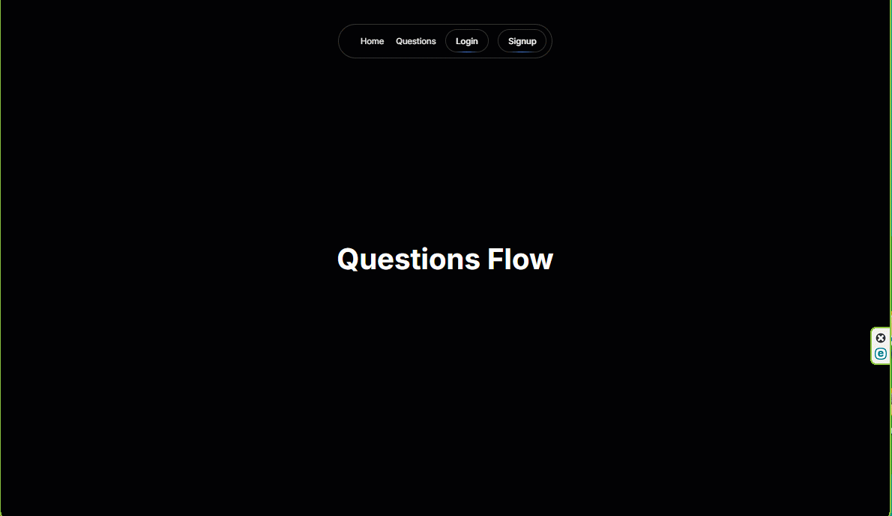

## Questions Flow App - Stack Overflow clone built with Next.js and Appwrite

###  The *main goal of this project* is to demonstrate my capabilities  in creating a product service that builds on [Appwrite](https://appwrite.io/) 

[SITE](https://appwrite-questions-flow-sxidsvit.vercel.app/)



### Tech Stack

- Next.js 14
- TypeScript
- Tailwind CSS
- [Magic UI](https://magicui.design/) - 50+ free and open-source animated components built with React, Typescript, Tailwind CSS, and Framer Motion.
- [Appwrite](https://appwrite.io/) - an open-source platform for build your entire backend within minutes and scale effortlessly
- [Appwrite Node.js SDK](https://github.com/appwrite/sdk-for-node)
- [Zustand](https://zustand-demo.pmnd.rs/)
- [React markdown Editor](https://www.npmjs.com/package/@uiw/react-markdown-editor)

### Features

- User authentication with email and password
- Questions and answers functionality
- Voting system functionality
- Comments functionality
- Search functionality
- Markdown editor


**Cloning the Repository**

```bash
git clone https://github.com/sxidsvit/appwrite-questions-flow.git 
cd appwrite-questions-flow
```

**Installation**

Install the project dependencies using npm:

```bash
npm install
```

**Set Up Environment Variables**

```env.local

NEXT_PUBLIC_APPWRITE_HOST_URL=
NEXT_PUBLIC_APPWRITE_PROJECT_ID=
APPWRITE_API_KEY=

```


**Running the Project**

```bash
npm run dev
```

Open [http://localhost:3000](http://localhost:3000) in your browser to view the project.


---

##### Contact with me:

[][linkedin]

[linkedin]: https://www.linkedin.com/in/sergiy-antonyuk/


##### I can't express how much I have learned from [you](https://chaicode.com/) ! <br> Thanks for the hard and smart work.
